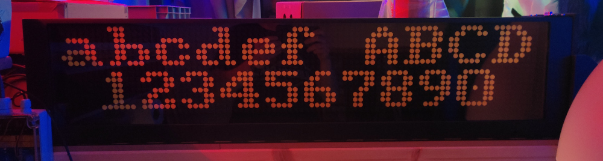

# flipControl
Full controller for **BROSE** and **LAWO FlipDot** panels based on STM32 µC. Controllable via RS232, RS485 or 3.3V Serial.
With the DIP switches you can decide between BROSE / LAWO and set more parameters without reprogramming.

<ins>Software/µC:</ins>
- **STM32F103C8Tx** / BluePill Dev-Board
- CubeMX and HAL Libs
- "compile_and_flash.sh" to complile and flash µC under Linux

<ins>Hardware/PCB:</ins>
- PCB + Circuit made with EAGLE 6.6.0
- Gerber Files are in "Gerber.zip"

Picture of the finished board with soldered RS323 interface:

Two different font types are possible (if you render the text with the MCU):

